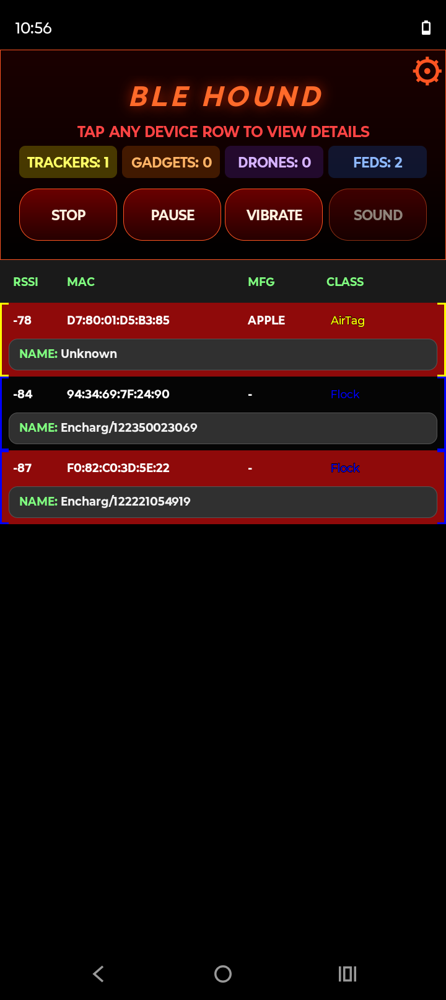
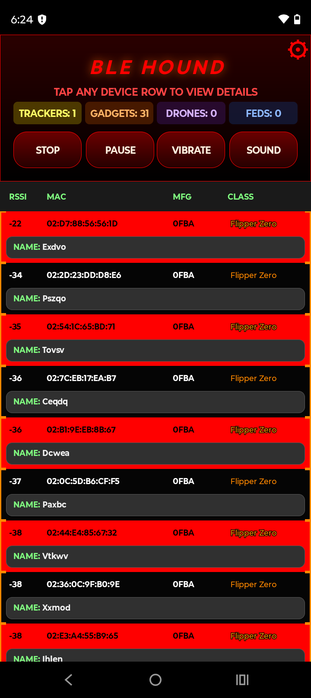
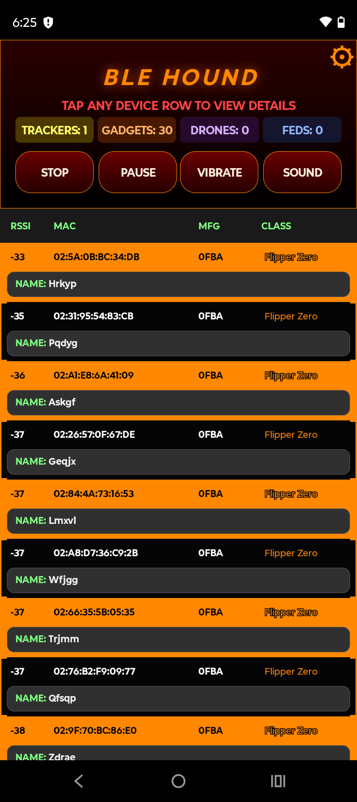
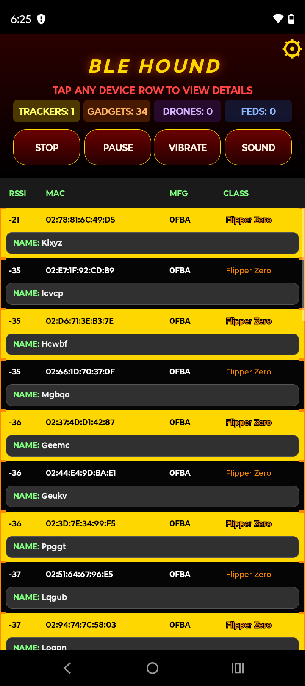
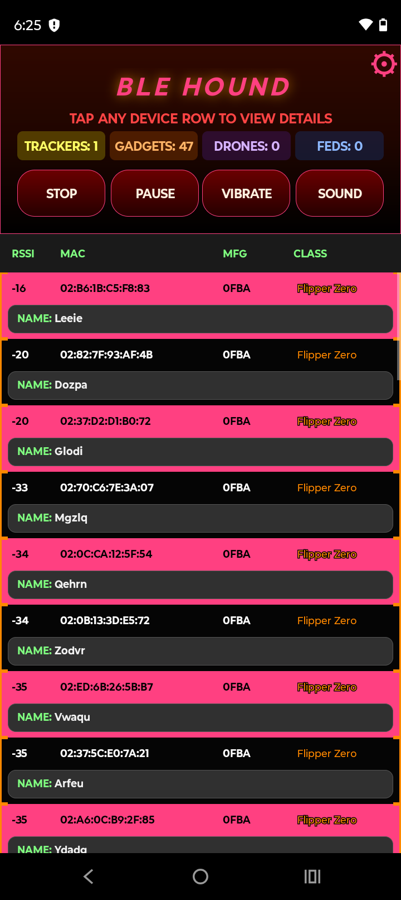
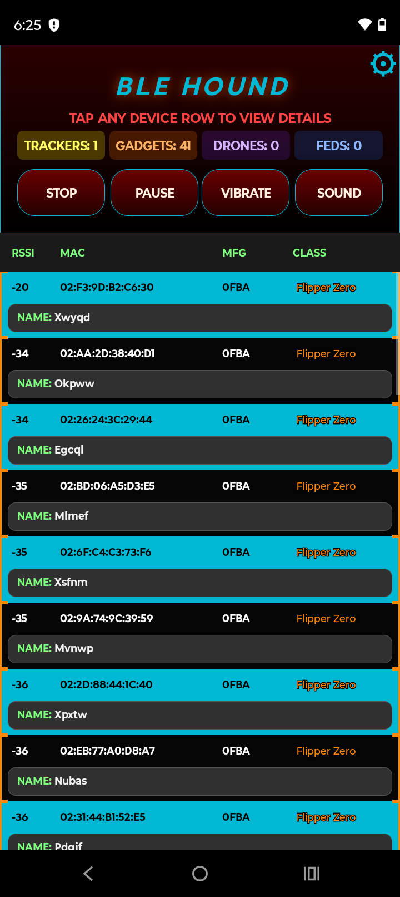
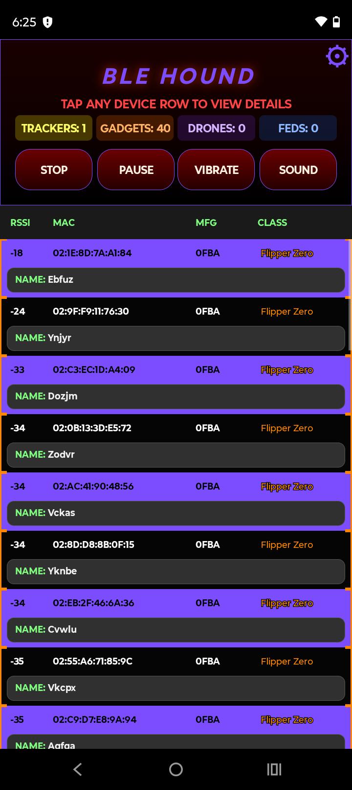
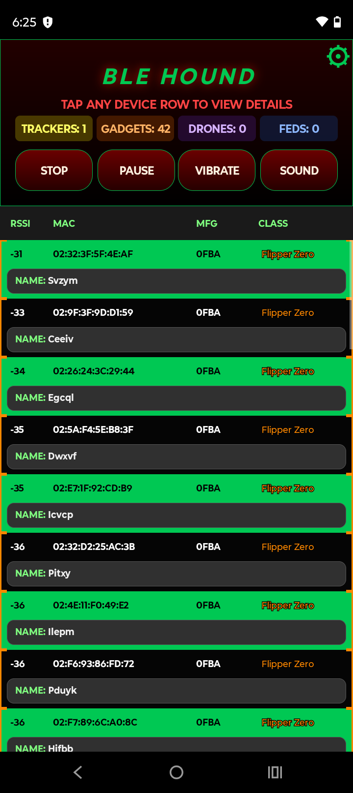
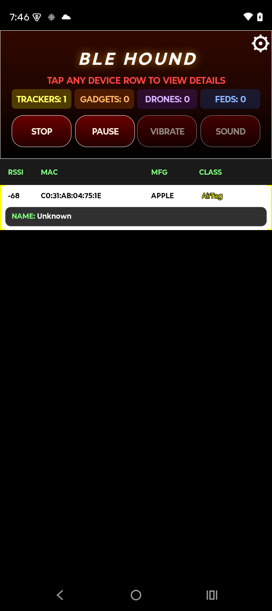
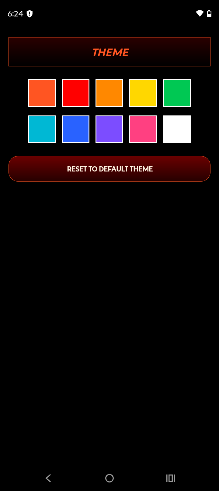

<h1 align="center">BLE Hound</h1>

<p align="center">
Android wireless situational awareness scanner focused on BLE tracking detection, device classification, real-time signal visibility, and practical field awareness.
</p>

<p align="center">
  <a href="https://github.com/GH0ST3CH/BLE-Hound/releases">
    
  </a>
  <a href="https://github.com/GH0ST3CH/BLE-Hound/blob/main/LICENSE">
    
  </a>
  <a href="https://github.com/GH0ST3CH/BLE-Hound/stargazers">
    
  </a>
  <a href="https://github.com/GH0ST3CH/BLE-Hound/network/members">
    
  </a>
</p>

<p align="center">
  <a href="https://github.com/GH0ST3CH/BLE-Hound/releases">Releases</a> •
  <a href="https://github.com/GH0ST3CH">GitHub</a> •
  <a href="https://buymeacoffee.com/ghostech">Buy Me a Coffee</a>
</p>

---

## Overview

BLE Hound is an Android Bluetooth Low Energy scanner built for fast wireless awareness and field use.

It detects and classifies nearby devices in real time with focus on:

- tracking devices
- cyber gadgets
- drones
- federally licensed / contracted devices
- background monitoring

The interface is designed for rapid scanning, quick visual sorting, live signal tracking, and practical situational awareness—primarily via BLE signals.

---

## Theme Gallery

<p align="center">
  
  
  
  
  
</p>

<p align="center">
  
  
  
  
  
</p>

<p align="center">
  
</p>

---

## Core Features

- Real-time BLE scanning
- Live device classification
- Live header category counters:
  - TRACKERS
  - GADGETS
  - DRONES
  - FEDS
- Color-matched classification system
- Device detail screen with:
  - live RSSI (live RSSI is used to locate proximity of signal based on signal strength)
  - raw advertisement data
  - manufacturer data
  - service UUIDs
  - GATT reads
- Optional vibration alerts
- Optional sound alerts
- Background monitoring mode
- Persistent Android notification with live counts
- Lock-screen visible monitoring
- Theme selection
- Settings / About screen with links and documentation

---

## Detection Categories

BLE Hound identifies devices directly instead of leaving them as generic BLE labels whenever enough evidence exists.

### Trackers
- AirTag
- Find My
- Tile
- Galaxy Tag

### Gadgets
- Flipper Zero
- Pwnagotchi
- Card skimmer patterns
- ESP32 / Arduino dev boards
- WiFi Pineapple patterns
- Meta Glasses

### Drones
- DJI
- Parrot
- Skydio
- Autel
- BLE Remote ID broadcasts

### Feds
- Axon
- Flock

---

## Signature-Based Detection

BLE Hound does not rely only on MAC address.

It builds a higher-value device signature from live signal data such as:

- transport type (BLE / Wi-Fi)
- classified device type
- manufacturer text
- manufacturer data
- service UUIDs
- service data
- appearance data
- raw advertisement payload

Stored format:

```text
SIG::<signature>##MAC::<device_mac>
```

Matching priority:

1. Signature match
2. MAC fallback

This gives BLE Hound better persistence than MAC-only handling, especially when devices rotate addresses.

---

## Blacklist / Whitelist

BLE Hound includes a signature-aware blacklist / whitelist system for persistent device handling.

### Included Behavior
- Signature-first matching
- MAC fallback matching
- Separate **View Blacklist** and **View Whitelist** modes
- Active list clearly indicated in UI
- Dynamic clear button based on active list
- Tap any saved entry to:
  - edit the displayed name
  - remove it individually

### Saved Entry Display
Saved entries are rendered in a UI style aligned with the main scanner list and include:

- CLASS
- NAME
- MFG
- MAC

### Detail Screen Integration
From the detail screen you can:

- whitelist a device
- blacklist a device
- remove a device from whitelist
- remove a device from blacklist

Button text updates dynamically based on current saved state.

---

## Interface

### Main Scanner Layout

| RSSI | MAC | MFG | CLASS |
|------|-----|-----|-------|

Each device also includes a second name row:

```text
NAME: DeviceName
```

### Color System
- Yellow: Trackers
- Orange: Gadgets
- Purple: Drones
- Blue / Red: Feds

The UI is built for fast visual interpretation without digging through menus.

---

## Controls

```text
START    : Begins scanning
STOP     : Stops active scan session
PAUSE    : Freezes list while preserving current session state
VIBRATE  : Toggles vibration alerts
SOUND    : Toggles sound alerts
```

---

## Background Monitoring

BLE Hound can continue monitoring outside the main scanner view.

### Background Monitoring Includes
- Persistent Android notification
- Live category counts
- Lock-screen visibility
- Popup alerts by selected devices
- Popup vibration control
- Popup sound tied to notification category sounds
- Optional blacklist popup behavior

Example persistent notification text:

```text
Trackers: 2   Gadgets: 1   Drones: 0   Feds: 0
```

---

## GATT Detail View

BLE Hound includes a structured GATT reader from the device detail page.

### GATT Data Includes
- service UUID
- service name
- characteristic UUID
- characteristic name
- values
- descriptor data
- notify events
- negotiated MTU

This makes it easier to inspect supported devices directly inside the app while staying in the same detail workflow.

---

## RSSI

RSSI = **Received Signal Strength Indicator**

Used for:

- proximity estimation
- locating the strongest signal
- directional walking
- practical signal hunting in the field

---

## Settings

Current settings include:

- Background monitoring
- Popup selection
- Popup vibration
- Notification sounds by category
- Theme controls
- Filtered mode
- Blacklist / whitelist management
- About / creator / link information

---

## Design Direction

BLE Hound prioritizes:

- rapid real-world awareness
- useful classification over generic BLE noise
- clean visual sorting
- low-friction field use
- practical monitoring instead of gimmicks

---

## Download

Get the latest APK here:

**https://github.com/GH0ST3CH/BLE-Hound/releases**

---

## Creator

**GH0ST3CH**

- GitHub: https://github.com/GH0ST3CH
  
- Support: https://buymeacoffee.com/ghostech
I spent/spend a great deal of time developing this app and provide it to the world without any paywalls. If you can afford the donation of a coffee via the link above, that would help me more than you might imagine. 

---

## Inspiration

### HaleHound
https://github.com/JesseCHale/HaleHound-CYD

### ESP32 Marauder
https://github.com/justcallmekoko/ESP32Marauder

---

## License

MIT  
https://github.com/GH0ST3CH/BLE-Hound/blob/main/LICENSE
